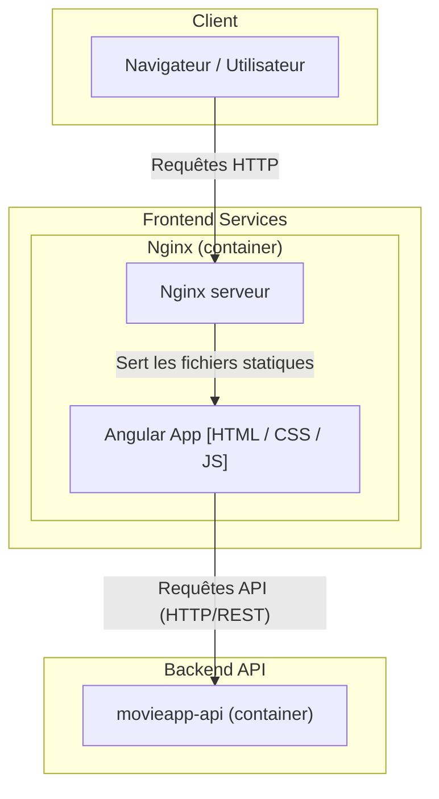

# 🎬 MovieApp UI

Frontend de l'application MovieApp, développé avec Angular et utilisant Angular Material pour offrir une interface utilisateur moderne et réactive. elle consomme les services exposés par le backend movieapp-api. Le tout est containerisé avec Docker pour faciliter le déploiement et la gestion des services.

---
https://github.com/user-attachments/assets/0461aca7-fcdd-4173-9c39-847a8112a4e1

---

## Architecture :


---

## 🚀 Lancement rapide

Assurez-vous d’avoir Docker installé, puis :

**Cloner le dépôt**

```bash
  git clone https://github.com/messaoudRm/movieapp-ui.git
  cd movieapp-ui
```

**Build l’application Angular en mode production**

```bash
  ng build --configuration=production
```

**Build l'image Docker**

```bash
  docker build -t movieapp-ui .
```

**Lancer le conteneur avec Nginx**

```bash
  docker run -d -p 4200:80 --name movieapp-ui movieapp-ui
```

L’application sera accessible sur : http://localhost:4200


## 🛑 Arrêter et relancer l'application

Arrêter l'application :

  ```bash
  docker stop movieapp-ui
  ```

Relancer le conteneur déjà créé :

  ```bash
  docker start movieapp-ui
  ```

## 🧹 Supprimer le conteneur et l'image

Arrêter et supprimer le conteneur :

  ```bash
  docker rm -f movieapp-ui
  ```
  
Supprimer l'image Docker utilisée :

  ```bash
  docker rmi movieapp-ui
  ```


