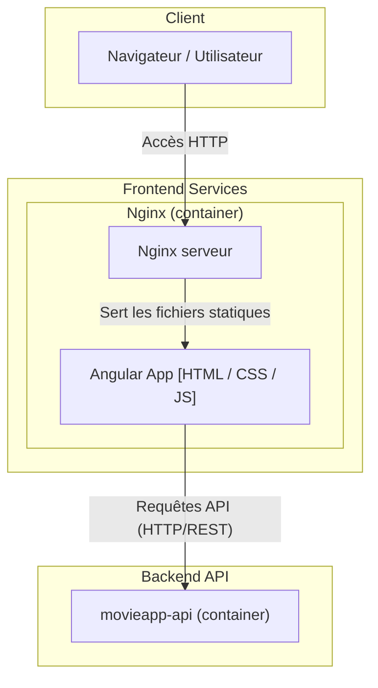

[⬅ Retour au README](../README.md)

# Architecture des conteneurs – Application Angular servie par Nginx

```mermaid
flowchart TB
    subgraph Client["Client"]
        user["Navigateur / Utilisateur"]
    end

    subgraph Frontend["Frontend Services"]
        subgraph NginxContainer["Nginx (container)"]
            direction TB
            nginx["Nginx serveur "]
            angularApp["Angular App [HTML / CSS / JS]"]
        end
    end

    subgraph Backend["Backend API"]
        api["movieapp-api (container)"]
    end

    %% Flèches
    user -->|"Accès HTTP"| nginx
    nginx -->|"Sert les fichiers statiques"| angularApp
    angularApp -->|"Requêtes API (HTTP/REST)"| api
```
